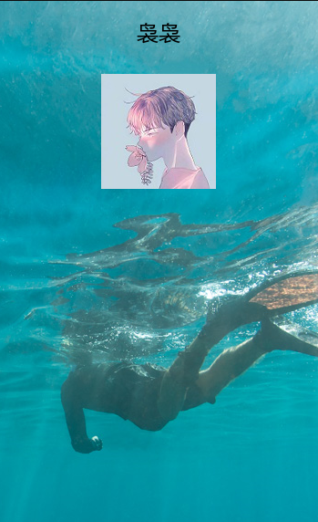

# PiecedImg
> 环境要求  
>  
> PHP >= 5.6  
> GD扩展 

### 介绍  
> 这是一个文字和图片拼凑的类,常见的应用场景是生成分享海报 

### 安装
```   
companies
```

### 示例
```
   <?php
   namespace Joey\PiecedImg\example;
      
   use Joey\PiecedImg\drive\Img;
   use Joey\PiecedImg\drive\PiecedImg;
   use Joey\PiecedImg\drive\Text;
   
   //合成一个文字
   $font = __DIR__ . "/ttf/MSYH.TTC";//字体的路径这里要用绝对路径
   $nickname = Text::marginTop(20)//上边距20
   ->align(Text::ALIGN_CENTER)//水平居中
   ->vertical(Text::ALIGN_START)//垂直 向上
   ->build("袅袅", $font);
   
   //合成一个头像
   $avatar = Img::align(Img::ALIGN_CENTER)//水平居中
   ->vertical(Img::ALIGN_START)//垂直 向上
   ->margin(80)//上下左右边距30
   ->build("img/avatar.jpg");//需要合成照片的地址
   
   
   //输出到本地
    PiecedImg::backgroundImage("img/background.png")
          ->merge($nickname)//拼凑 昵称
          ->merge($avatar)//拼凑 头像
          ->writeSave('./uploads/poster.png');//输出到本地
   
   //输出到浏览器
   header("Content-type : image/png");
   PiecedImg::backgroundImage("img/background.png")
       ->merge($nickname)//拼凑 昵称
       ->merge($avatar)//拼凑 头像
       ->writeString();//输出到浏览器
   //die();如果浏览器一堆乱码,则加上这句
```
> 输出到浏览器的图片  



### 使用说明  
因为PiecedImg用到了魔术方法所以对ide的支持很不友好,所以把所有方法列出来,以免还需查看源码.
<br>  
<br>  
#### 公共方法   
* margin(...$arg) //参数有1个,则上下左右边距都是参数一;参数有2个则上下边距和左右边距分别是参数一,参数二;参数有4个,则参数分辨对应,上右下左边距
* marginTop($arg1) //上边距为$arg1
* marginBottom($arg1) //下边距为$arg1  
* marginRight($arg1) //右边距为$arg1  
* marginLeft($arg1) //左边距为$arg1    
* align($arg) //水平排列,默认Text::ALIGN_START;Text::ALIGN_START左对齐,ALIGN_CENTER居中,ALIGN_END右对齐  
* vertical($arg) //垂直排列,默认Text::ALIGN_START;Text::ALIGN_START上对齐,ALIGN_CENTER居中,ALIGN_END下对齐 
----
 #### 图片生成器   
 * opacity(...$arg) //图片的透明层度0-1;若0.5则为半透明
 * build($arg1) //需要拼凑的图片路径,最后调用
 
----
 #### 文字生成器   
 * size($arg) //文字大小,默认18
 * color($arg,$arg,$arg) //文字的颜色,如0,0,0表示黑色,默认黑色
 * angle($arg,) //文字的角度,默认0
 * build($arg1,$arg2) //$arg1:需要填写的文字,$arg2:字体的路径,需要绝对路径
----
 #### 生成图片
 * backgroundImage($arg) //必须先静态调用,背景图
 * merge($arg) //参数为图片生成器或者文字生成器,可调用多个,多个按照先后顺序合成
 * writeString() //输出浏览器
 * writeSave($arg1) //输出本地,$arg1表时存储的位置
 
 > 注意事项
 > * 所有类都需要先静态调用在链式操作,如Text::size(27)->build($text,$font);这样做的好处是,第一不要new一个类出来,第二每条链式的参数都互不影响.
 > * 如果调用输出浏览器出现乱码,那么需要在结尾加上die();
 > * 字体的路径需要绝对路径可以__DIR__."/相对路径";  
 > * 如果计算出来的元素坐标未负数,那么定位会初始化到0,0,比如元素比背景图大,尽量排除这种因素.
 
 <br>
   
 > 如果有BUG可以,发送邮箱liujunyi.coder@gmail.com,VX:ad19960906,发issues.